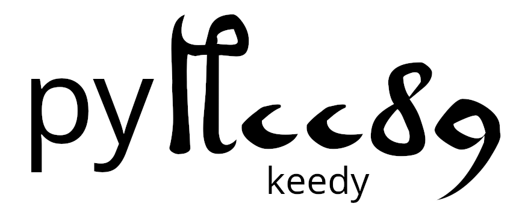

<p align="center">
  
</p>

A Python library for easy statistical analysis of the Voynich Manuscript.

## Installation
```
pip install pykeedy
```

Development:
```
git clone https://github.com/pwspen/pykeedy.git
cd pykeedy
pip install -e .
```

## Features
- Easily-loadable VMS transliteration (EVA or CUVA alphabet)
- Filtering by every available property (Currier language, illustration type, locus type, etc)
- Handful of comparison manuscripts in European languages + easily load and chuck em all into the same analysis
- Naibbe encoder supporting arbitrary encoding tables + decoder implementing algorithm from paper
- Plotter functions for common data types / analyses (see examples)
- Functions to easily calculate, at either character or word level:
    - n-gram frequency rank (most common character, word, character pair, word pair...)
    - n-gram co-occurence (aka, pair attraction for n=2)
    - entropy
        - single (Shannon), pair, conditional
    - Position distributions (letter in word, word in line, letter in page, etc)

## Usage
```python
from pykeedy import VMS, LocusProp
from pykeedy.analysis import shannon_entropy, conditional_entropy
from pykeedy.utils import load_corpus, scatterplot
from pykeedy.crypt import naibbe_encrypt

vms = VMS.to_text() # Single string
vms = VMS.to_lines() # List of line strings
vms = VMS.to_words() # List of word strings
vms = VMS.to_text(alphabet="cuva", normalize_gaps=False) # Processing options

voynich_b = VMS.filter(props=[LocusProp.CurrierLanguage.B]).to_text() # Filter by any property, or many at once

plains = load_corpus() # Loads set of comparison plaintexts (Latin, German, Italian)

analyze = {}
for name, text in plains.items()
    analyze[name] = text
    # Encrypt each plaintext in method that best matches Voynich statistical properties
    analyze[name + '_naibbe_encrypt'] = naibbe_encrypt(text)
analyze['vms b'] = voynich_b # Add VMS

results = {name: (shannon_entropy(text), conditional_entropy(text)) for name, text in analyze.items()}

scatterplot(results) # Saves to scatterplot.png
```

## Documentation
The current documentation is 10+ very thoroughly commented examples which you can find in the `examples` folder.
There are examples that do each of the following in around 20 lines or less:
- Calculate word frequency in Voynich A and B and save a plot for each
- Plot character and conditional entropy for the VMS vs plaintext comparison manuscripts
- Calculate and plot word length distribution (token and type)
- Plot character and word co-occurence / pair attraction heatmaps
- Calculate and plot most common word & character pairs / triplets
- Plot entropies of VMS + plaintexts + Naibbe cipher encryptions of those plaintexts
You can see all of the generated plots in `examples/results.md`

## Goals
Library goals:
1. Lower the barrier to entry for Voynich statistical analysis
    - There are some tools out there, but they're scattered, relatively basic, and far from user friendly, even for programmers. This library aims to be very capable while not sacrificing any usability.
2. Reproduce all the important statistical results in one place
    - There is a TON of analysis out there, but it's even more scattered, and a lot of it is just results with no reproduction available, which means it's very difficult to tweak and experiment with and build on.

Issues & PRs very welcome!

## TODO
- Advanced
    - [ ] Automated topic analysis
    - [ ] Clustering of similar words
        - Show that it's much more common in Voynich than plaintext
    - [ ] Levenshtein distance network generation
    - [ ] Reference self-citation algorithm

- [ ] Find better corpus for comparison manuscripts
- [ ] Option to generate subplots
    - Produce all example plots for any language
- [ ] More options for dealing with spaces and newlines in entropy, freq, cooccurence analysis
- [ ] STA alphabet support
- [ ] Glyph and vord pair attraction symmetry scalar
- [ ] Support for recognizing single glyphs in non-basic EVA
- [ ] Measure of encoding ambiguity - if you always pick the most likely option, how likely are you to be right?
- [ ] Voynich font alongside transliteration for plots
- [ ] basic testing suite
- [ ] docstrings
- [ ] support for bitrans rulefiles
- [ ] encoding scorer
    - basic: ambiguity, reconstruction
    - advanced: match to VMS properties, simplicity

## Voynich resources

[Voynich Forum](https://www.voynich.ninja/)

[Most complete source of Voynich information](https://www.voynich.nu/) (by Rene Zandbergen)
- [Voynich transliteration](https://www.voynich.nu/transcr.html)
- [Page by page overview](http://voynich.nu/q01/index.html)
- Existing Voynich software by Rene
    - [bitrans](http://www.voynich.nu/software/bitrans/Bitrans_manual.pdf) - performs plaintext substitutions
    - [IVTT](http://voynich.nu/software/ivtt/IVTT_manual.pdf) - CLI for filtering and removing metadata from IVTFF files
    - You should not need either of these if you are using this library
[Most detailed Voynich scan](https://collections.library.yale.edu/catalog/2002046)
- [Scan browser](https://www.voynich.ninja/browser/default.cfm?v=1006075&r=1006082)
- [Multispectral imaging](https://manuscriptroadtrip.wordpress.com/2024/09/08/multispectral-imaging-and-the-voynich-manuscript/) [(direct link)](https://drive.google.com/drive/folders/1mNQGKQDSCR4M_c2M2JrsU5soghvYwMig)

[Naibbe cipher paper](https://www.dropbox.com/scl/fo/2b39zi1f77tr9mc9p80rt/ADwDDHsLNG7WtT6O0sbN5_4?download=true&e=4&from_auth=login&preview=20250724+Naibbe+Cipher+Paper+Latest+Version.pdf&rlkey=5ap828aun23thr9pvznguzgor&st=88np74hd&dl=0)

[IVTFF format explanation](https://www.voynich.nu/software/ivtt/IVTFF_format.pdf)

[Voynich Unicode](https://www.kreativekorp.com/software/fonts/voynich/)