The clump in the bottom left is all the Naibbe encrypted texts, with similar entropy to VMS.

  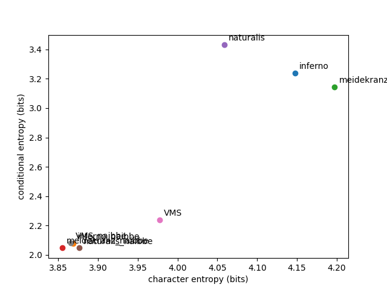

  
  
Red: Dante's Inferno (Italian)
  
Blue: Der Meide Kranz (German)
  
Green: Pliny's Naturalis Historia (Latin)
  
Yellow: Voynich Manuscript
  
(This is the complete set of texts currently available in this library)
  
Frequency is normalized, so 0.1 means that character or word is 10% of the total chars / words, 0.001 means 1/1000 of total, etc.
  
Below: Character n-grams
  

  
  
  
  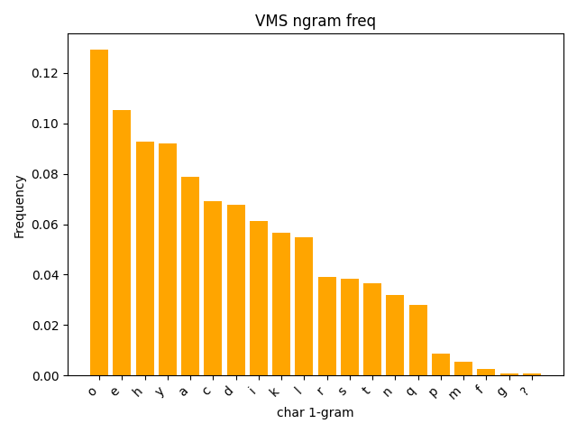

  
  
  
  
  

  
  
  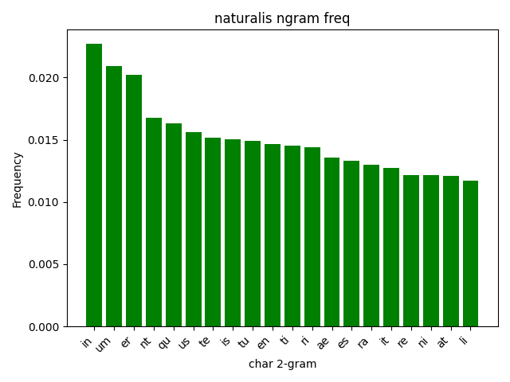
  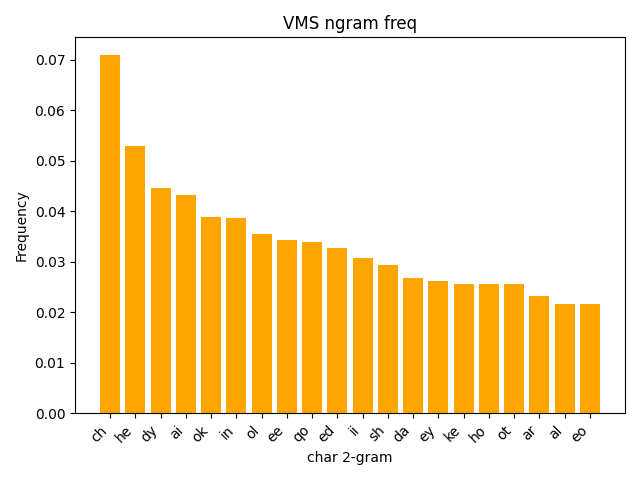

  
  
  
  
  

  
  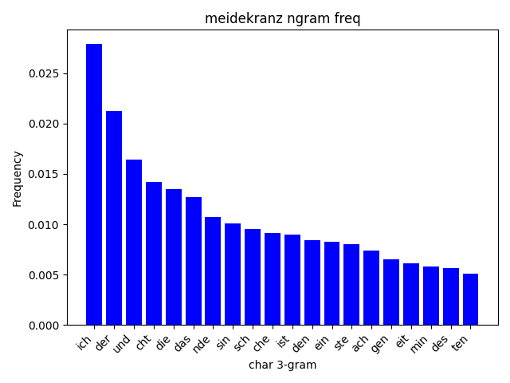
  
  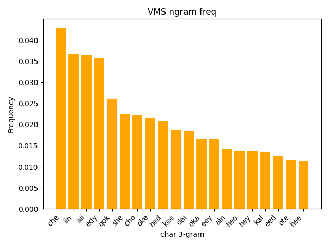

  
  
  
  
Below: Word n-grams
  

  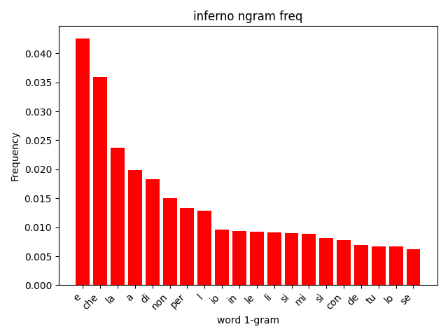
  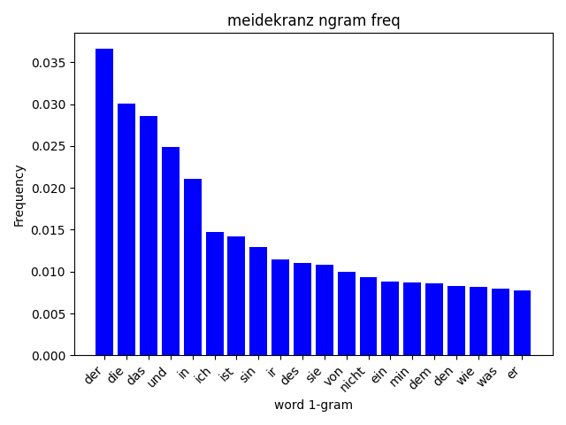
  
  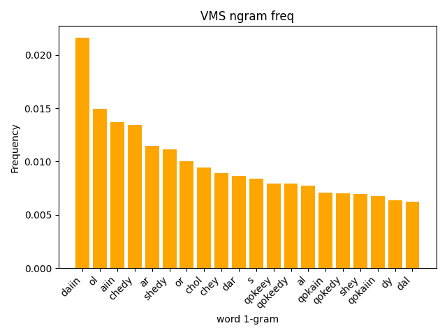

  
  
  
  
  

  
  
  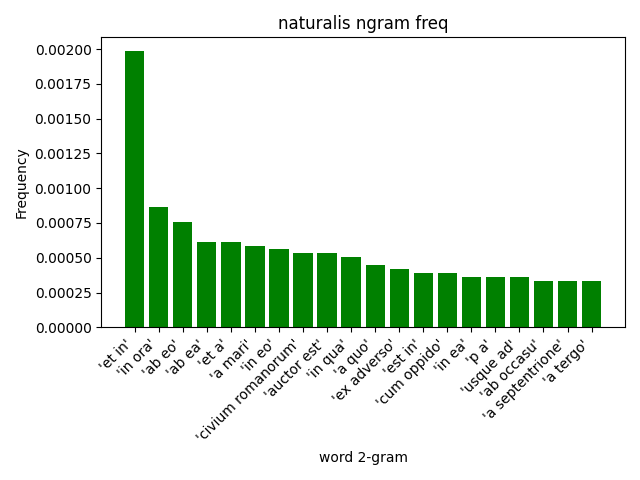
  

  
  
  
  
  

  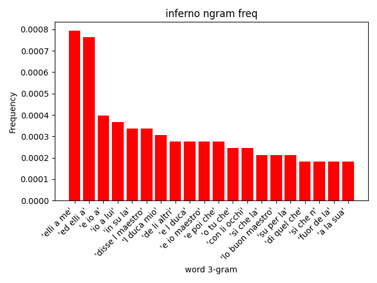
  
  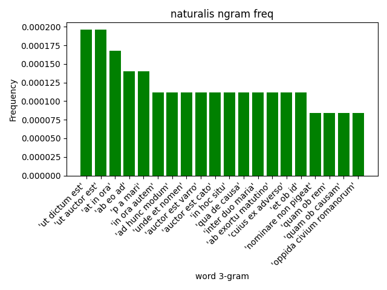
  

  
  
  
Below: Character and word co-occurences, similarly normalized (a-e = 0.1 means it is 10% of all letter pairs)
  
20 most common shown for each
  

  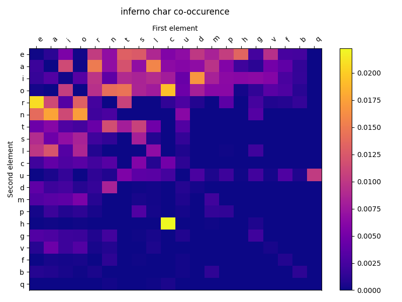
  
  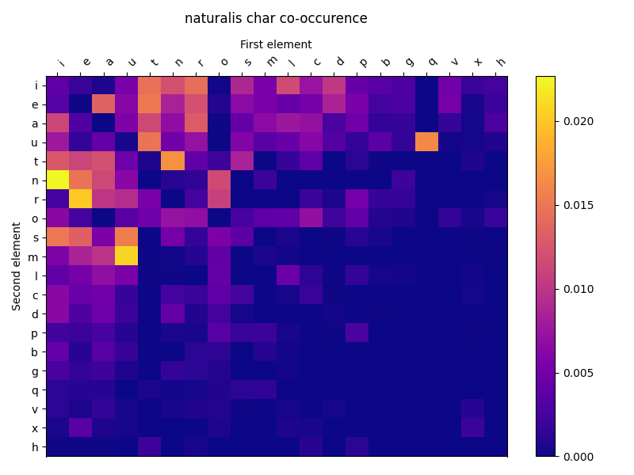
  

  
  
  
  
  

  
  
  
  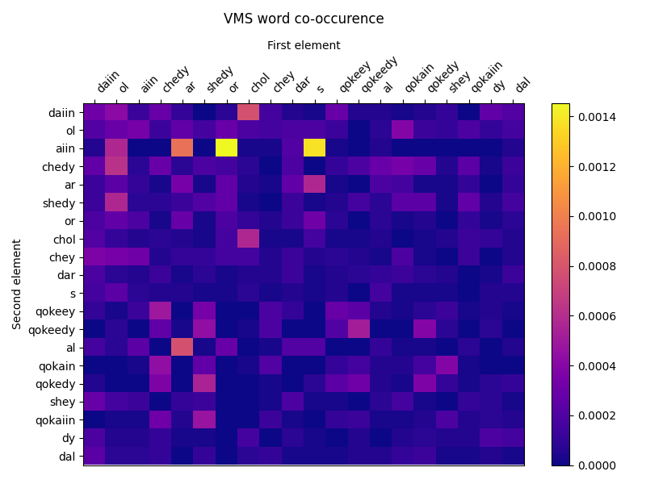

  
  
  
  
Below: Word lengths (not normalized)
  

  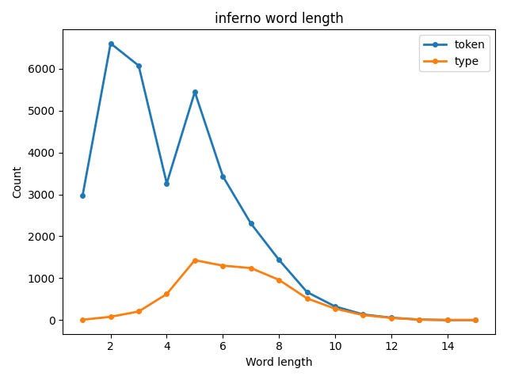
  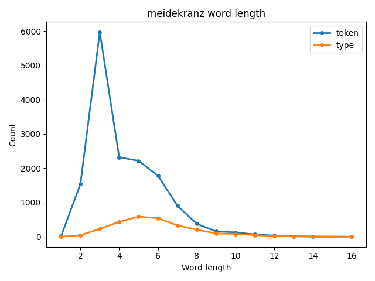
  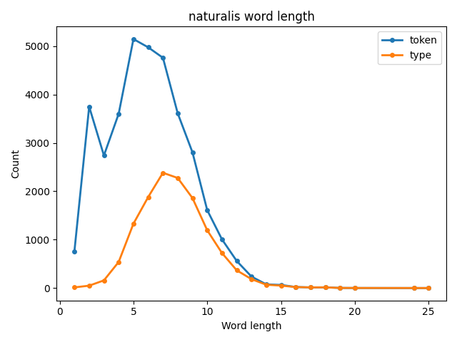
  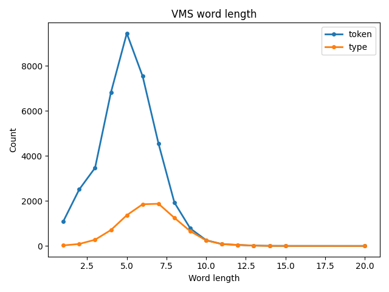

  
  
  
Below: Average positions of letters in words, words in lines, and words in manuscripts
  
20 most common items shown for each, most common always on left
  

  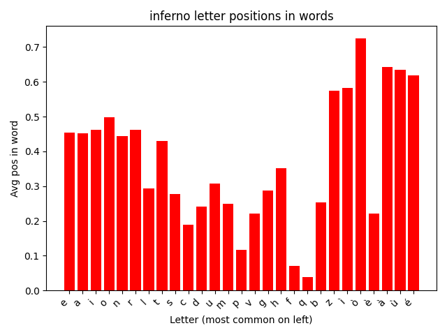
  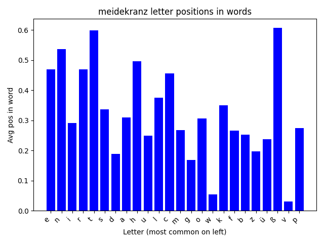
  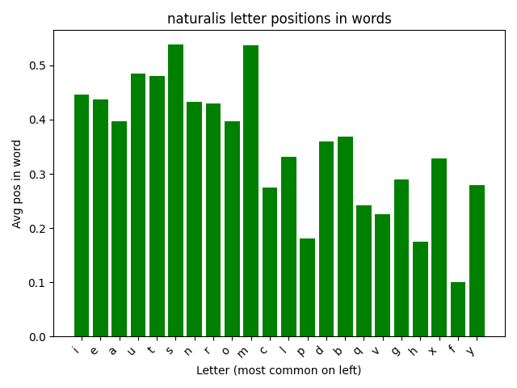
  

  
  
  
  
  

  
  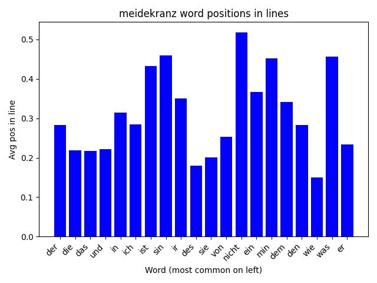
  
  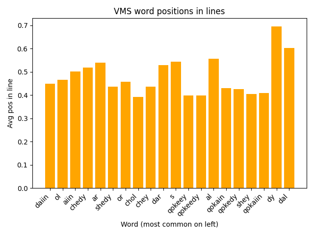

  
  
  
  
  

  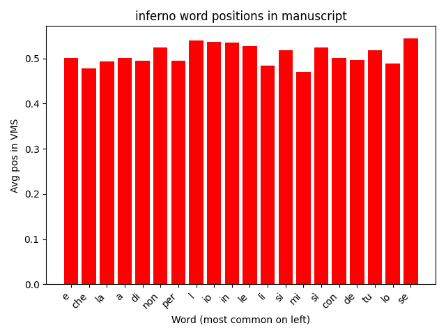
  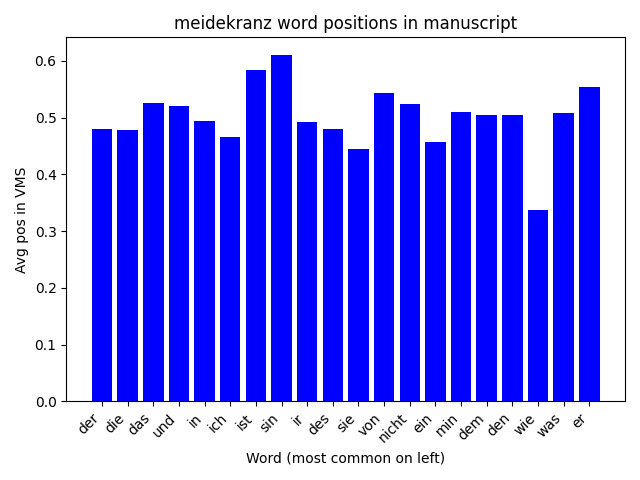
  
  

  
  
  
  
  
